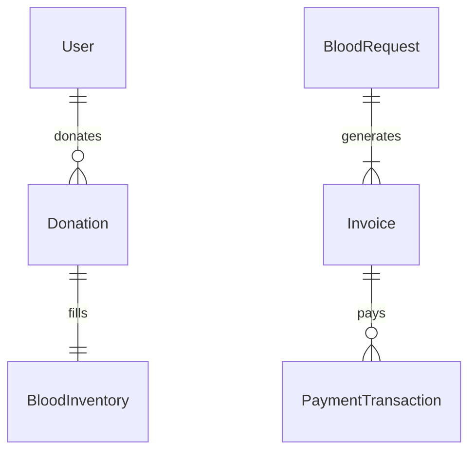

# Blood Bank Management System — Product Requirements Document (PRD)

---

## 1. Project Overview

**Name:** Blood Bank Management System (BBMS)

**Purpose:**

A robust, microservices-based full-stack application enabling secure, real-time management of blood donations, inventory, hospital requests, billing, and notifications. The system connects donors, blood banks, and hospitals, ensuring compliance with government pricing and audit requirements.

**Key Goals:**

* Streamline blood donation and request workflows
* Maintain accurate, real-time inventory
* Automate billing with government-approved rates
* Provide role-based access and secure APIs
* Send event-driven notifications
* Enable full auditability and recovery via soft-deletes
* **Common Homepage & Dynamic UI** : A unified landing page for all visitors; upon login, users see role-specific dashboards and services tailored to their permissions.

---

## 2. Target Users & Roles

| Role                      | Permissions                                                                                   |
| ------------------------- | --------------------------------------------------------------------------------------------- |
| **DONOR**           | Register, view/edit profile, donate blood, view donation history, receive notifications       |
| **HOSPITAL_ADMIN**  | Request blood units, view request status, view invoices, make payments, receive notifications |
| **BLOODBANK_ADMIN** | Manage blood bank profile, inventory, approve/reject donations & requests, manage blood rates |
| **SYSTEM_ADMIN**    | Full access across all microservices: user management, audit logs, system configuration       |

---

## 3. Architecture & Microservices

**Architecture Pattern:**  Microservices with service discovery, API gateway, asynchronous messaging.

| Microservice                   | Responsibility                                     | Tech Stack & Versions                                           |
| ------------------------------ | -------------------------------------------------- | --------------------------------------------------------------- |
| **Eureka Server**        | Service registry                                   | Spring Cloud Netflix Eureka (2023.0.1)                          |
| **API Gateway**          | Routing, authentication, rate limiting             | Spring Cloud Gateway (2023.0.1)                                 |
| **auth-service**         | JWT issuance/validation, security filters          | Spring Boot 3.4.5, JWT 0.12.6, Spring Security                  |
| **user-service**         | User CRUD, roles, soft-delete, password hashing    | Spring Boot 3.4.5, Spring Data JPA, MSSQL                       |
| **bloodbank-service**    | Blood bank CRUD, inventory search/filter dashboard | Spring Boot 3.4.5, Spring Data JPA, MSSQL                       |
| **donation-service**     | Donation tracking, inventory linkage               | Spring Boot 3.4.5, Spring Data JPA, MSSQL                       |
| **bloodrequest-service** | Hospital requests, status workflows                | Spring Boot 3.4.5, Spring Data JPA, MSSQL                       |
| **billing-service**      | Blood rates, invoices, payments                    | Spring Boot 3.4.5, Spring Data JPA, MSSQL, Razorpay/Stripe SDKs |
| **notification-service** | Event-driven notifications via RabbitMQ            | Spring Boot 3.4.5, Spring AMQP, RabbitMQ                        |
| **audit-service**        | Centralized audit logs for actions                 | Spring Boot 3.4.5, Spring Data JPA, MSSQL                       |
| **hospital-service** *   | (Optional) Multi-hospital management               | Spring Boot 3.4.5, Spring Data JPA, MSSQL                       |
| **frontend**             | Angular 19 SPA with role-based UI                  | Angular 19, Bootstrap, Mermaid.js charts                        |

*Optional microservice for multi-hospital support.

---

## 4. Database & Entities

Each microservice uses its own MSSQL schema. Soft deletes (`is_deleted`) and audit logs ensure recoverability.

### 4.1 user-service

**Table: users**

* **id** : UUID PK
* username: VARCHAR
* email: VARCHAR
* password: VARCHAR (BCrypt)
* phone_number: VARCHAR
* role: ENUM (DONOR, HOSPITAL_ADMIN, BLOODBANK_ADMIN, SYSTEM_ADMIN)
* status: ENUM (ACTIVE, INACTIVE)
* is_deleted: BOOLEAN DEFAULT FALSE
* created_at: DATETIME
* updated_at: DATETIME

### 4.2 bloodbank-service

**Table: blood_banks**

* id: BIGINT PK
* name: VARCHAR
* address: VARCHAR
* state: VARCHAR
* city: VARCHAR
* contact_number: VARCHAR
* category: ENUM (GOVERNMENT, RED_CROSS, CHARITABLE, PRIVATE)
* is_deleted: BOOLEAN DEFAULT FALSE
* created_at: DATETIME

**Table: blood_inventory**

* id: BIGINT PK
* blood_bank_id: FK → blood_banks.id
* blood_group: ENUM (A+, A-, B+, B-, AB+, AB-, O+, O-)
* quantity: INT
* storage_location: VARCHAR
* donation_id: FK → donations.id
* last_updated: DATETIME

### 4.3 donation-service

**Table: donations**

* id: BIGINT PK
* donor_id: FK → users.id
* blood_bank_id: FK → blood_banks.id
* blood_group: ENUM
* quantity: INT
* donation_date: DATETIME
* donation_status: ENUM (PENDING, SCHEDULED, COMPLETED, APPROVED, REJECTED)
* blood_inventory_id: FK → blood_inventory.id (nullable)
* is_deleted: BOOLEAN DEFAULT FALSE

### 4.4 bloodrequest-service

**Table: blood_requests**

* id: BIGINT PK
* hospital_admin_id: FK → users.id
* blood_bank_id: FK → blood_banks.id
* blood_group: ENUM
* quantity: INT
* request_date: DATETIME
* request_status: ENUM (PENDING, APPROVED, INVOICE_GENERATED, FULFILLED, REJECTED)
* is_deleted: BOOLEAN DEFAULT FALSE

### 4.5 billing-service

**Table: blood_rates**

* id: BIGINT PK
* blood_group: ENUM
* rate_per_unit: DECIMAL
* effective_from: DATE
* blood_bank_id: FK → blood_banks.id
* created_by: FK → users.id
* is_deleted: BOOLEAN DEFAULT FALSE

**Table: invoices**

* id: BIGINT PK
* blood_request_id: FK → blood_requests.id
* blood_rate_id: FK → blood_rates.id
* amount: DECIMAL
* invoice_date: DATETIME
* status: ENUM (PAID, UNPAID, FAILED)
* is_deleted: BOOLEAN DEFAULT FALSE

**Table: payment_transactions**

* id: BIGINT PK
* invoice_id: FK → invoices.id
* paid_amount: DECIMAL
* payment_date: DATETIME
* payment_mode: ENUM (UPI, CARD, CASH)
* transaction_status: ENUM (SUCCESS, FAILED, PENDING)
* is_deleted: BOOLEAN DEFAULT FALSE

### 4.6 notification-service

**Table: notifications**

* id: BIGINT PK
* user_id: FK → users.id
* donation_id: FK → donations.id (nullable)
* blood_request_id: FK → blood_requests.id (nullable)
* invoice_id: FK → invoices.id (nullable)
* message: VARCHAR
* notification_type: ENUM (DONATION, REQUEST, PAYMENT)
* notification_status: ENUM (SENT, FAILED, PENDING)
* retry_count: INT DEFAULT 0
* error_reason: TEXT (nullable)
* created_at: DATETIME
* is_deleted: BOOLEAN DEFAULT FALSE

### 4.7 audit-service

**Table: audit_logs**

* id: BIGINT PK
* user_id: FK → users.id
* action_type: ENUM (CREATE, UPDATE, DELETE, LOGIN, APPROVAL)
* entity_type: ENUM (USER, BLOOD_REQUEST, BLOOD_RATE, etc.)
* entity_id: VARCHAR
* timestamp: DATETIME
* description: TEXT

### 4.8 hospital-service (Optional)

**Table: hospitals**

* id: BIGINT PK
* name: VARCHAR
* address: VARCHAR
* state: VARCHAR
* city: VARCHAR
* contact_number: VARCHAR
* hospital_admin_id: FK → users.id
* is_deleted: BOOLEAN DEFAULT FALSE

---

## 5. Relationships and ERD

Full ERD available in separate Mermaid file.

---

## 6. API Endpoints (Sample)

* **auth-service** :
* `POST /auth/register`
* `POST /auth/login`
* **user-service** :
* `GET /users/{id}`
* `POST /users`
* `PUT /users/{id}`
* **bloodbank-service** :
* `GET /bloodbanks`
* `POST /bloodbanks`
* `GET /inventory?state=&city=&group=`

(Full OpenAPI specs to be created per service.)

---

## 7. Technology Stack & Tools

* **IDE** : VSCode Insiders
* **Backend** : Java 21, Spring Boot 3.4.5, Spring Cloud 2023.0.1, JWT 0.12.6, RabbitMQ
* **Frontend** : Angular 19, Bootstrap
* **Database** : Microsoft SQL Server (SSMS)
* **API Testing** : Postman
* **Diagrams** : Draw.io, Mermaid.js
* **Payments** : Razorpay / Stripe / PayPal (Dev APIs)

---

## 8. Development Plan & Milestones

**Overall Timeline:** Complete core functionality in **2–3 days** with AI-assisted development.

1. **Day 1:**
   * Setup repository, CI/CD scaffolding
   * Configure Eureka Server & API Gateway
   * Establish common homepage and role-based routing in frontend
2. **Day 2:**
   * Implement `auth-service` & `user-service` (registration, login, JWT)
   * Create dynamic UI components in Angular for role-based dashboards
   * Build `bloodbank-service` & dashboard search by state/city/group
3. **Day 3:**
   * Develop `donation-service`, `bloodrequest-service`, and inventory linkage
   * Implement `billing-service` with rate-management page for admins
   * Set up `notification-service` and `audit-service`
   * Conduct end-to-end integration testing via Postman and frontend demo

---

## 9. UI/UX Examples

* **Admin Dashboard** : Card-based inventory overview, tables with filters, modals for CRUD
* **Donor Portal** : Simplified forms, donation history timeline, notification bell
* **Hospital Dashboard** : Request form wizard, invoice history, payment integration widget

---

*End of PRD*
