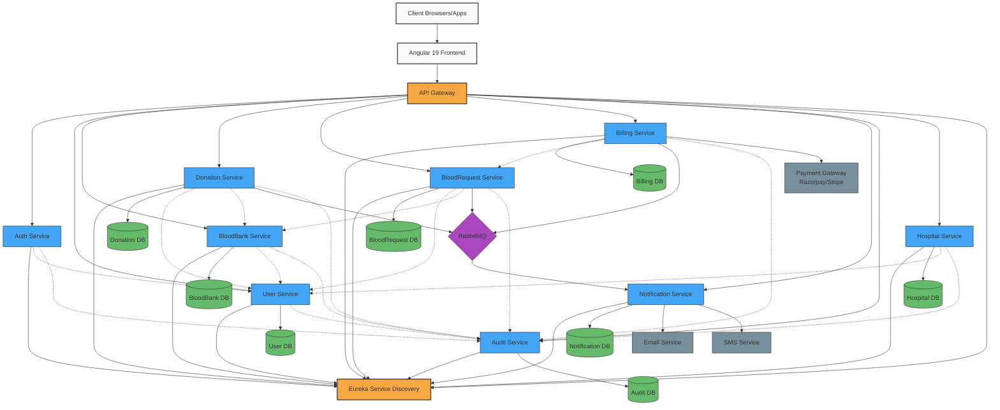

# Blood Bank Management System - System Architecture

## End-to-End System Architecture Diagram



## Detailed Component Architecture

### 1. Client Layer
- Web browsers
- Mobile applications (potential future expansion)

### 2. Frontend Layer
- **Angular 19 SPA**
  - Common homepage for all users
  - Role-based dynamic UI components
  - Bootstrap for responsive design
  - Mermaid.js for dynamic charts and visualizations

### 3. API Gateway & Service Discovery
- **API Gateway** (Spring Cloud Gateway 2023.0.1)
  - Authentication/Authorization filter
  - Request routing
  - Load balancing
  - Rate limiting
  - Request/response transformation

- **Eureka Server** (Spring Cloud Netflix Eureka 2023.0.1)
  - Service registration
  - Service discovery
  - Health monitoring

### 4. Core Microservices
All microservices built with Spring Boot 3.4.5 and related dependencies:

- **auth-service**
  - JWT token issuance & validation
  - Security filters
  - Role-based access control

- **user-service**
  - User CRUD operations
  - Role management
  - Password hashing (BCrypt)
  - Soft-delete functionality

- **bloodbank-service**
  - Blood bank profile management
  - Blood inventory tracking
  - Search/filter capabilities

- **donation-service**
  - Donation tracking
  - Workflow management (pending → scheduled → completed)
  - Inventory linkage

- **bloodrequest-service**
  - Hospital blood requests
  - Request approval workflow
  - Status tracking

- **billing-service**
  - Blood rate management
  - Invoice generation
  - Payment processing
  - Integration with payment gateways

- **notification-service**
  - Event-driven notifications
  - Multiple channel support (email, SMS)
  - Retry mechanism

- **audit-service**
  - Centralized audit logging
  - Action tracking
  - Compliance reporting

- **hospital-service** (Optional)
  - Hospital profile management
  - Multi-hospital support

### 5. Database Layer
- Microsoft SQL Server with separate schema per microservice
- Soft delete functionality (is_deleted flag)
- Audit trail columns (created_at, updated_at)

### 6. Messaging Layer
- **RabbitMQ** for asynchronous communication
  - Donation events
  - Blood request events
  - Billing events
  - Notification events

### 7. External Services
- **Payment Gateways** (Razorpay/Stripe/PayPal)
- **Email Service Provider**
- **SMS Service Provider**

## Data Flow Examples

### Donation Flow
1. Donor logs in through frontend
2. Donation request created via donation-service
3. BloodBank admin approves donation
4. Inventory updated in bloodbank-service
5. Event published to RabbitMQ
6. Notification sent to donor
7. Audit log created

### Blood Request Flow
1. Hospital admin logs in
2. Blood request created via bloodrequest-service
3. BloodBank admin approves request
4. Inventory updated in bloodbank-service
5. Invoice generated by billing-service
6. Payment processed through payment gateway
7. Events published to RabbitMQ
8. Notifications sent to hospital admin
9. Audit logs created

## Security Architecture
- JWT-based authentication
- Role-based authorization
- Password hashing with BCrypt
- HTTPS for all communications
- Rate limiting at API Gateway
- Input validation at service level

## Deployment Architecture
- Docker containers for all services
- Kubernetes for orchestration (optional)
- CI/CD pipeline for automated deployment

## Scaling Strategy
- Horizontal scaling of individual microservices
- Database read replicas for high-traffic services
- Caching for frequently accessed data
```

## Implementation Guidelines

This architecture follows best practices for microservice architecture:

1. **Service Independence**: Each service has its own database and can be developed, deployed, and scaled independently.

2. **API Gateway Pattern**: Centralizes authentication, routing, and cross-cutting concerns.

3. **Event-Driven Architecture**: Uses RabbitMQ for asynchronous communication between services.

4. **Database per Service**: Each microservice owns its data and exposes it via APIs.

5. **Service Discovery**: Eureka enables services to find and communicate with each other without hardcoded URLs.

6. **Resilience**: Retry mechanisms, circuit breakers can be implemented for fault tolerance.

7. **Monitoring & Observability**: Logs and audit trails provide visibility into system behavior.

When implementing this architecture, prioritize establishing the core infrastructure (Eureka, API Gateway) followed by auth-service and user-service, before moving to domain-specific services.
