# Blood Bank Management System - Data Flow Diagram

## Key User Flows and System Interactions

```mermaid
flowchart TD
    %% Define participants
    User([User/Client])
    API[API Gateway]
    Auth[Auth Service]
    UserSvc[User Service]
    BloodBank[BloodBank Service]
    Donation[Donation Service]
    Request[BloodRequest Service]
    Billing[Billing Service]
    Notif[Notification Service]
    Audit[Audit Service]
    RMQ{RabbitMQ}
    Payment[Payment Gateway]
    
    %% Authentication Flow
    subgraph "Authentication Flow"
        User -->|1. Login Request| API
        API -->|2. Forward Auth Request| Auth
        Auth -->|3. Validate Credentials| UserSvc
        UserSvc -->|4. Return User Details| Auth
        Auth -->|5. Generate JWT Token| API
        API -->|6. Return JWT Token| User
    end
    
    %% Donation Flow
    subgraph "Blood Donation Flow"
        User -->|1. Submit Donation Request| API
        API -->|2. Forward Request| Donation
        Donation -->|3. Create Donation Record| Donation
        Donation -->|4. Check Donor Eligibility| UserSvc
        Donation -->|5. Notify BloodBank| BloodBank
        BloodBank -->|6. Approve/Reject Donation| Donation
        Donation -->|7. Publish Event| RMQ
        RMQ -->|8. Consume Event| Notif
        Notif -->|9. Send Notification| User
        Donation -.->|Log Activity| Audit
    end
    
    %% Blood Request Flow
    subgraph "Blood Request Flow"
        User -->|1. Request Blood Units| API
        API -->|2. Forward Request| Request
        Request -->|3. Create Request Record| Request
        Request -->|4. Check Hospital Admin| UserSvc
        Request -->|5. Check Inventory| BloodBank
        BloodBank -->|6. Approve/Reject Request| Request
        Request -->|7. Generate Invoice| Billing
        Billing -->|8. Create Payment Link| Payment
        Payment -->|9. Process Payment| Billing
        Request -->|10. Publish Event| RMQ
        RMQ -->|11. Consume Event| Notif
        Notif -->|12. Send Notification| User
        Request -.->|Log Activity| Audit
        Billing -.->|Log Activity| Audit
    end
    
    %% Inventory Management Flow
    subgraph "Inventory Management Flow"
        BloodBank -->|1. Update Inventory| BloodBank
        BloodBank -->|2. Publish Inventory Event| RMQ
        RMQ -->|3. Consume Event| Notif
        Notif -->|4. Notify Low Stock| User
        BloodBank -.->|Log Activity| Audit
    end
    
    %% Styling
    classDef user fill:#f9f9f9,stroke:#333,stroke-width:2px
    classDef gateway fill:#f5a742,stroke:#333,stroke-width:2px
    classDef service fill:#42a5f5,stroke:#333,stroke-width:1px
    classDef messaging fill:#ab47bc,stroke:#333,stroke-width:1px
    classDef external fill:#78909c,stroke:#333,stroke-width:1px
    
    class User user
    class API gateway
    class Auth,UserSvc,BloodBank,Donation,Request,Billing,Notif,Audit service
    class RMQ messaging
    class Payment external
```

## System Interaction Details

### 1. Authentication Flow
- User submits login credentials via the frontend
- API Gateway forwards the request to Auth Service
- Auth Service validates credentials with User Service
- If valid, JWT token is generated and returned to the client
- Token contains encrypted user role information
- All subsequent requests include this JWT token in the Authorization header

### 2. Blood Donation Flow
- Donor logs in and submits donation request
- Donation Service creates a record and checks eligibility with User Service
- Blood Bank admin is notified of pending donation
- Once approved, inventory is updated in the Blood Bank Service
- Events trigger notifications to the donor about donation status
- All activities are logged in the Audit Service

### 3. Blood Request Flow
- Hospital admin logs in and submits blood request
- BloodRequest Service validates the request and checks inventory
- If approved, the Billing Service generates an invoice
- Payment processing through external payment gateway
- Upon successful payment, blood units are marked for fulfillment
- Notification events are published to RabbitMQ
- Hospital admin receives notifications about request status
- All activities are audit-logged

### 4. Inventory Management Flow
- Blood Bank Service maintains real-time inventory counts
- Low stock triggers automatic notifications
- Inventory changes are logged for audit and compliance
- Dashboard provides real-time visualization of inventory levels

### 5. Notification Patterns
- Event-driven architecture using RabbitMQ
- Asynchronous processing ensures system responsiveness
- Failed notifications are retried with exponential backoff
- Multiple notification channels (email, SMS) based on user preferences

## Technology Implementation

### Async Communication (RabbitMQ)
Events published include:
- DonationCompletedEvent
- BloodRequestApprovedEvent
- LowInventoryEvent
- InvoiceGeneratedEvent
- PaymentProcessedEvent

### Security Implementation
- JWT tokens include:
  - User ID
  - Role (DONOR, HOSPITAL_ADMIN, BLOODBANK_ADMIN, SYSTEM_ADMIN)
  - Expiration time
  - Signature for validation

### Error Handling Strategy
- Circuit breakers for external service calls
- Graceful degradation when dependent services are unavailable
- Comprehensive error logging and monitoring
