# Blood Bank Management System - Deployment Architecture

This document outlines the deployment architecture for the Blood Bank Management System, covering infrastructure setup, deployment strategies, and scaling considerations.

```mermaid
flowchart TD
    %% Client Layer
    Client[Client\nBrowsers/Apps]
    
    %% Load Balancer
    LB[Load Balancer]
    
    %% Frontend Server
    FrontendServer[Static Web Server\nAngular App]
    
    %% Containerized Services
    subgraph "Container Orchestration Platform (Kubernetes/Docker Swarm)"
        APIGateway[API Gateway]
        Eureka[Eureka Service\nDiscovery]
        
        subgraph "Core Microservices"
            Auth[Auth Service]
            User[User Service]
            BloodBank[BloodBank Service]
            Donation[Donation Service]
            BloodRequest[BloodRequest Service]
            Billing[Billing Service]
            Notification[Notification Service]
            Audit[Audit Service]
            Hospital[Hospital Service]
        end
    end
    
    %% Databases
    subgraph "Database Cluster"
        MSSQL[(SQL Server\nCluster)]
        
        subgraph "Database Schemas"
            UserDB[(User Schema)]
            BloodBankDB[(BloodBank Schema)]
            DonationDB[(Donation Schema)]
            RequestDB[(Request Schema)]
            BillingDB[(Billing Schema)]
            NotificationDB[(Notification Schema)]
            AuditDB[(Audit Schema)]
            HospitalDB[(Hospital Schema)]
        end
    end
    
    %% Message Broker
    RabbitMQ{RabbitMQ Cluster}
    
    %% External Services
    subgraph "External Services"
        PaymentGateway[Payment Gateway API]
        EmailService[Email Service]
        SMSService[SMS Service]
    end
    
    %% Monitoring & Logging
    subgraph "Monitoring & Logging"
        Prometheus[Prometheus]
        Grafana[Grafana]
        ElasticSearch[ElasticSearch]
        Kibana[Kibana]
    end
    
    %% CI/CD Pipeline
    subgraph "CI/CD Pipeline"
        Git[Git Repository]
        Jenkins[Jenkins]
        DockerRegistry[Docker Registry]
    end
    
    %% Connection Lines
    Client --> LB
    LB --> FrontendServer
    LB --> APIGateway
    
    %% API Gateway Connections
    APIGateway --> Auth
    APIGateway --> User
    APIGateway --> BloodBank
    APIGateway --> Donation
    APIGateway --> BloodRequest
    APIGateway --> Billing
    APIGateway --> Notification
    APIGateway --> Audit
    APIGateway --> Hospital
    
    %% Service Discovery
    Auth --> Eureka
    User --> Eureka
    BloodBank --> Eureka
    Donation --> Eureka
    BloodRequest --> Eureka
    Billing --> Eureka
    Notification --> Eureka
    Audit --> Eureka
    Hospital --> Eureka
    APIGateway --> Eureka
    
    %% Database Connections
    User --> UserDB
    BloodBank --> BloodBankDB
    Donation --> DonationDB
    BloodRequest --> RequestDB
    Billing --> BillingDB
    Notification --> NotificationDB
    Audit --> AuditDB
    Hospital --> HospitalDB
    
    %% All DB schemas in SQL Server
    UserDB --- MSSQL
    BloodBankDB --- MSSQL
    DonationDB --- MSSQL
    RequestDB --- MSSQL
    BillingDB --- MSSQL
    NotificationDB --- MSSQL
    AuditDB --- MSSQL
    HospitalDB --- MSSQL
    
    %% Message Broker
    Donation --> RabbitMQ
    BloodRequest --> RabbitMQ
    Billing --> RabbitMQ
    RabbitMQ --> Notification
    
    %% External Service Connections
    Billing --> PaymentGateway
    Notification --> EmailService
    Notification --> SMSService
    
    %% Monitoring Connections
    APIGateway -.-> Prometheus
    Auth -.-> Prometheus
    User -.-> Prometheus
    BloodBank -.-> Prometheus
    Donation -.-> Prometheus
    BloodRequest -.-> Prometheus
    Billing -.-> Prometheus
    Notification -.-> Prometheus
    Audit -.-> Prometheus
    Hospital -.-> Prometheus
    RabbitMQ -.-> Prometheus
    MSSQL -.-> Prometheus
    
    Prometheus --> Grafana
    
    %% Logging Connections
    APIGateway -.-> ElasticSearch
    Auth -.-> ElasticSearch
    User -.-> ElasticSearch
    BloodBank -.-> ElasticSearch
    Donation -.-> ElasticSearch
    BloodRequest -.-> ElasticSearch
    Billing -.-> ElasticSearch
    Notification -.-> ElasticSearch
    Audit -.-> ElasticSearch
    Hospital -.-> ElasticSearch
    ElasticSearch --> Kibana
    
    %% CI/CD Flow
    Git --> Jenkins
    Jenkins --> DockerRegistry
    DockerRegistry --> Auth
    DockerRegistry --> User
    DockerRegistry --> BloodBank
    DockerRegistry --> Donation
    DockerRegistry --> BloodRequest
    DockerRegistry --> Billing
    DockerRegistry --> Notification
    DockerRegistry --> Audit
    DockerRegistry --> Hospital
    DockerRegistry --> APIGateway
    DockerRegistry --> Eureka
    
    %% Styling
    classDef client fill:#f9f9f9,stroke:#333,stroke-width:2px
    classDef gateway fill:#f5a742,stroke:#333,stroke-width:2px
    classDef service fill:#42a5f5,stroke:#333,stroke-width:1px
    classDef database fill:#66bb6a,stroke:#333,stroke-width:1px
    classDef messaging fill:#ab47bc,stroke:#333,stroke-width:1px
    classDef monitoring fill:#ff7043,stroke:#333,stroke-width:1px
    classDef ci fill:#78909c,stroke:#333,stroke-width:1px
    
    class Client,LB,FrontendServer client
    class APIGateway,Eureka gateway
    class Auth,User,BloodBank,Donation,BloodRequest,Billing,Notification,Audit,Hospital service
    class MSSQL,UserDB,BloodBankDB,DonationDB,RequestDB,BillingDB,NotificationDB,AuditDB,HospitalDB database
    class RabbitMQ messaging
    class Prometheus,Grafana,ElasticSearch,Kibana monitoring
    class Git,Jenkins,DockerRegistry ci
```

## Deployment Environment Setup

### Infrastructure Requirements

#### Development Environment
- Development workstations: VSCode with Spring Boot extensions, Angular CLI
- Local Docker containers for services and databases
- Shared development RabbitMQ instance
- MockServer for simulating external services

#### Testing Environment
- Containerized services with test databases
- Integration test suite automation
- Performance testing tools (JMeter)
- Security scanning (OWASP ZAP)

#### Staging Environment
- Kubernetes cluster (smaller scale)
- Pre-production database with anonymized data
- Full external service integrations using test accounts
- Load testing capability

#### Production Environment
- High-availability Kubernetes cluster
- SQL Server cluster with failover and backup strategy
- RabbitMQ cluster with mirrored queues
- Geographically distributed load balancers
- CDN for static frontend assets

### Resource Requirements

#### Compute Resources (Per Environment)

| Service | CPU (Cores) | RAM (GB) | Storage (GB) | Instances |
|---------|-------------|----------|--------------|-----------|
| API Gateway | 2 | 4 | 20 | 2-4 |
| Eureka Server | 1 | 2 | 10 | 2 |
| Microservices (each) | 1-2 | 2-4 | 20 | 2+ |
| SQL Server | 4-8 | 16-32 | 500+ | 2 (HA) |
| RabbitMQ | 2 | 4 | 50 | 3 (cluster) |
| Monitoring Stack | 2 | 8 | 100 | 1 |

## Deployment Strategy

### Container Orchestration

The system uses Kubernetes for container orchestration with:

1. **Namespace Separation**:
   - `bbms-prod` - Production environment
   - `bbms-staging` - Staging environment
   - `bbms-monitoring` - Monitoring tools

2. **Deployment Configuration**:
   - Rolling updates strategy
   - Resource limits and requests
   - Health checks and readiness probes
   - Auto-scaling based on CPU/memory utilization

3. **Service Exposure**:
   - Internal ClusterIP services for inter-service communication
   - LoadBalancer service for API Gateway
   - Ingress controller for path-based routing

### CI/CD Pipeline

1. **Source Control**: Git repository with branch protection
   - `main` - Production code
   - `staging` - Pre-release testing
   - `develop` - Integration branch
   - Feature branches for development

2. **Build Process**:
   - Jenkins pipeline or GitHub Actions
   - Maven/Gradle build for Java services
   - npm build for Angular frontend
   - Docker image creation and scanning
   - Automated tests execution

3. **Deployment Automation**:
   - Infrastructure as Code (Terraform/Pulumi)
   - Kubernetes manifests or Helm charts
   - Automated database migrations
   - Environment-specific configuration management

## Scaling Strategy

### Horizontal Scaling

- API Gateway and microservices configured for auto-scaling
- Scale based on CPU utilization (target: 70%)
- Minimum 2 instances per service for high availability

### Database Scaling

- Read replicas for high-read services (inventory, user lookups)
- Connection pooling optimization
- Regular index optimization and query performance monitoring

### Caching Strategy

- Redis cluster for frequently accessed data
  - User session information
  - Blood inventory counters
  - Authentication tokens

## High Availability Configuration

### Component Redundancy

- Multiple instances across availability zones
- Database clustering with automated failover
- RabbitMQ clustering with mirrored queues

### Data Backup & Recovery

- Daily automated backups
- Point-in-time recovery capability
- 30-day retention policy
- Quarterly disaster recovery testing

## Monitoring & Observability

### Health Metrics

- Service uptime and response times
- Error rates and request volumes
- Resource utilization (CPU, memory, disk, network)
- Queue depths and processing rates

### Business Metrics

- Donation rates and inventory levels
- Request fulfillment rates
- Processing times for key workflows
- Payment success/failure rates

### Alerting Rules

- Service downtime > 1 minute
- Error rate > 1% over 5 minutes
- API response time > 500ms for 95th percentile
- Low blood inventory alerts (< 10 units per group)
- Failed payment transactions

## Security Considerations

### Network Security

- Private subnets for all services except load balancers
- Network policies restricting inter-service communication
- TLS for all service communications
- WAF for API Gateway

### Data Protection

- Encryption at rest for all databases
- TLS for data in transit
- Key management service for secrets
- Regular security audits

## Compliance Requirements

- HIPAA compliance for medical data
- PCI DSS compliance for payment processing
- Data retention policies as per local regulations
- Audit logging for all sensitive operations
